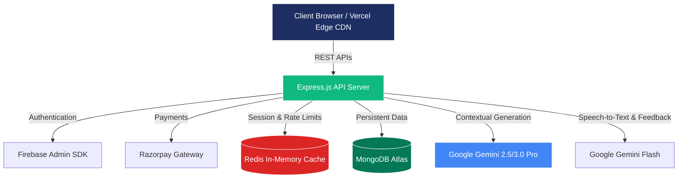

<div align="center">
  
  <br/>
  <h1>PrepHire - AI-Powered Mock Interview Platform</h1>
  <p>
    <strong>Unlock Your Potential with Real-Time, Voice-Enabled AI Mock Interviews</strong>
    <br />
    <br />
    <em>A production-grade, full-stack SaaS application designed to help job seekers master their interview skills through contextual, real-time voice and text interviews powered by Google's Gemini Advanced AI models.</em>
  </p>

  <p>
    <a href="https://prephire.co"></a>
    <a href="https://api.prephire.co"></a>
  </p>
  
  <p>
    
    
    
    
    
  </p>
</div>

<br />

---

## 📖 Table of Contents

- [Project Overview](#-project-overview)
- [Comprehensive Feature Set](#-comprehensive-feature-set)
- [System Architecture](#-system-architecture)
- [Tech Stack Details](#-tech-stack-details)
- [Core Workflows](#-core-workflows)
- [Security & Performance Guidelines](#-security--performance-guidelines)
- [Monetization & Credits System](#-monetization--credits-system)
- [Project Directory Structure](#-project-directory-structure)
- [Quick Start Installation](#-quick-start-installation)
- [Author](#-author)

---

## 🌟 Project Overview

**PrepHire** is a modern SaaS platform addressing a critical gap in job preparation: realistic, domain-specific interview practice. Utilizing the MERN stack along with Google Generative AI capabilities, the platform dynamically generates interview questions tailored to a user's uploaded resume, desired domain, and seniority level.

The platform distinguishes itself by offering **real-time voice transcription and evaluation**. Users interact with a 3D avatar, speaking naturally into their microphone. The backend processes the audio, evaluates the response using Gemini AI, and provides instant, multi-dimensional feedback.

---

## ✨ Comprehensive Feature Set

### 🎙️ Voice-First AI Interviews
- **Real-Time Voice Processing:** Speak directly to the AI using the microphone. The app captures, visualizes, and transcribes audio seamlessly.
- **Interactive 3D Avatar:** A dynamic 3D speaking avatar powered by React Three Fiber makes the interview feel conversational and human-like.
- **Audio Visualization:** Real-time visual feedback of audio inputs enhances user engagement and confirms microphone activity.

### 📄 Intelligent Contextualization
- **Resume Parsing Engine:** Upload PDF resumes. The system analyzes the document to extract skills, experience, and context to generate highly personalized questions.
- **Job Description (JD) Extraction:** Input a JD URL, and the platform utilizes Cheerio to scrape and extract core requirements to shape the interview focus.
- **Adaptive Difficulty:** Choose from Junior, Mid-level, or Senior difficulty profiles. The AI adapts its questioning rigor accordingly.

### 📊 Deep Analytics & Scoring
- **Multi-Dimensional Feedback:** Every answer is evaluated on a comprehensive rubric: *Correctness, Clarity, and Confidence*.
- **Weak Area Identification:** The system aggregates data across sessions to highlight technical or soft-skill blind spots.
- **Session History & Review:** Users can browse past interviews, review specific questions, their transcribed answers, and the AI’s suggested ideal responses.

### 💳 Integrated Payments
- **Razorpay Integration:** A robust, cryptographically secure payment pipeline allows users to purchase additional interview credits on demand.
- **Freemium Model:** Automatically replenishes 3 free interview credits monthly to encourage retention.

---

## 🏗 System Architecture

The application is built as a highly decoupled monolith, ensuring fast iterations while maintaining enterprise-level security and scalability.



---

## 🛠 Tech Stack Details

### 🎨 Frontend Ecosystem
- **Core:** `React 18`, `Vite 7` (for blazing fast HMR and builds)
- **Styling:** `Tailwind CSS 4` for utility-first styling, ensuring a highly responsive and modern UI.
- **Animations & 3D:** `Framer Motion` for page transitions/micro-interactions, and `@react-three/fiber` & `@react-three/drei` for the speaking avatar.
- **State & Routing:** `React Router DOM` for SPA navigation, custom Context APIs for global state management.
- **Data Visualization:** `Recharts` for displaying performance metrics.
- **Authentication:** `Firebase Client SDK` (Email/Password, OAuth).

### ⚙️ Backend Infrastructure
- **Core:** `Node.js` with `Express 5` framework.
- **Database:** `MongoDB` managed via `Mongoose` ORM for persistent data (Users, Sessions, Transactions).
- **Caching & Rate Limiting:** `Redis` to manage API abuse and session caching.
- **AI Integration:** `@google/generative-ai` SDK utilizing a sophisticated fallback chain (Pro -> Flash -> Lite) to handle quota limits and transient errors gracefully.
- **File Handling:** `Multer` and `pdf-parse` for secure resume ingestion and processing.
- **Security:** `Helmet`, `Cors`, `express-rate-limit`, and custom Zod validators to comply with OWASP top 10.

---

## 🔄 Core Workflows

### The Interview Lifecycle
1. **Setup:** The user defines the domain, difficulty, and optionally uploads a resume or JD URL.
2. **Generation:** The backend prompts the Gemini model to generate a curated list of technical and behavioral questions.
3. **Execution:** The frontend presents questions sequentially. The user can opt for text input or record voice responses.
4. **Evaluation:** Voice data is uploaded securely (max 50MB audio). The backend uses Gemini's multimodal capabilities to transcribe and score the answer in real time.
5. **Completion:** The session is saved to MongoDB. The user is redirected to a detailed dashboard breaking down their performance.

---

## 🔒 Security & Performance Guidelines

PrepHire is engineered with **OWASP best practices** embedded at the core:

- **Comprehensive Rate-Limiting Matrix:** 
  - *Global IP limits* to prevent DDoS.
  - *User-based Redis limits* to prevent authenticated API abuse.
  - *Strict payment/auth limits* to stop brute-forcing and fraud.
- **Strict Input Validation:** All incoming requests are validated and sanitized using `Zod` schemas. Parameter pollution middleware prevents array-based injection attacks.
- **Secure Payments:** Payment callbacks utilize constant-time HMAC signature checks (`crypto.timingSafeEqual`) to prevent timing attacks.
- **AI Resiliency:** The backend incorporates a robust Gemini API fallback strategy. It detects `429` rate limits and seamlessly cascades to alternative models (e.g., 2.5-flash to 2.0-flash) to ensure the platform remains available.

---

## 💰 Monetization & Credits System

The platform leverages **Razorpay** to offer a flexible Freemium business model.
- **Monthly Resets:** A background check ensures users receive a baseline of 3 free interviews per month.
- **Top-Up Purchases:** Users can securely purchase additional bundles (e.g., 1 Interview, 3 Interviews). The transaction flow is fully idempotent, ensuring users never get billed twice for a single order intent.
- **Credit Guards:** Frontend Higher-Order Components (`<CreditGuard>`) seamlessly block access to the interview flow if a user's balance is zero, prompting the pricing modal.

---

## 📁 Project Directory Structure

```text
ai-interview-platform/
├── ai-interview-platform-backend/       # Express server
│   ├── config/                          # DB, Redis, Firebase setups
│   ├── controllers/                     # Core business logic (Auth, Interview, Resume, Payments)
│   ├── middleware/                      # OWASP security, Rate limiters, Auth checks
│   ├── models/                          # Mongoose schemas (User, InterviewSession, Transaction)
│   ├── routes/                          # API route definitions
│   ├── utils/                           # Helpers (Gemini fallback engine, Email transporters)
│   └── validators/                      # Zod validation schemas
│
└── ai-interview-platform-frontend/      # React client
    ├── public/                          # Static assets
    └── src/
        ├── api/                         # Axios instances and API endpoint wrappers
        ├── components/
        │   ├── features/                # Domain-specific UI (Interview, Landing, Monetization)
        │   ├── guards/                  # Route protection (AuthGuard, CreditGuard)
        │   ├── layout/                  # Shared UI (Navbar, Footer, SEO)
        │   └── ui/                      # Reusable atoms (Buttons, Modals, Toasts)
        ├── context/                     # Global state (Auth, Notifications)
        ├── hooks/                       # Custom React hooks
        ├── pages/                       # Route entry points (Dashboard, InterviewFlow, etc.)
        └── styles/                      # Global CSS and Tailwind configurations
```

---

## 🚀 Quick Start Installation

Follow these steps to get the platform running locally.

### 1. Clone the repository
```bash
git clone https://github.com/IamGaurav001/ai-interview-platform.git
cd ai-interview-platform
```

### 2. Configure & Start Backend
The backend requires MongoDB, Redis, and several API keys (Google Gemini, Razorpay, Firebase).

```bash
cd ai-interview-platform-backend
npm install
cp .env.example .env

# Open .env and fill in:
# - MONGODB_URI
# - REDIS_URL
# - GEMINI_API_KEY
# - RAZORPAY_KEY_ID & RAZORPAY_KEY_SECRET
# - FIREBASE Admin Credentials

npm run dev
```
*The backend will run on `http://localhost:5000`*

### 3. Configure & Start Frontend
The frontend requires Firebase Client keys and the backend URL.

```bash
cd ../ai-interview-platform-frontend
npm install
cp .env.example .env

# Open .env and fill in:
# - VITE_API_URL=http://localhost:5000
# - VITE_FIREBASE_* credentials
# - VITE_RAZORPAY_KEY_ID

npm run dev
```
*The frontend will run on `http://localhost:5173`*

---

<div align="center">
  <p>Built with ❤️ by <strong>Gaurav Kumar Dubey</strong></p>
  <p>
    <a href="https://github.com/IamGaurav001">
      
    </a>
  </p>
</div>
