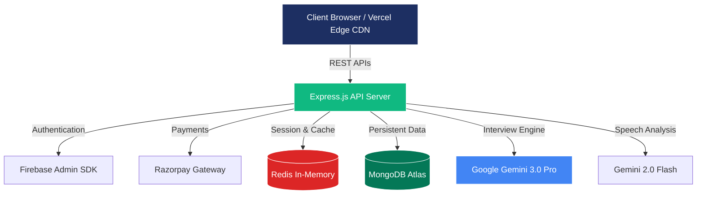

<div align="center">
  
  <br/>
  <h1>PrepHire</h1>
  <p>
    <strong>Unlock Your Potential with AI-Powered Mock Interviews</strong>
    <br />
    <br />
    <em>A production-grade, full-stack SaaS application that conducts real-time, voice-enabled AI mock interviews powered by Google Gemini 3.0 Pro.</em>
  </p>

  <p>
    <a href="https://prephire.co"></a>
    <a href="https://api.prephire.co"></a>
  </p>
  
  <p>
    
    
    
    
    
  </p>
</div>

<br />

---

## 📖 Table of Contents

<details>
  <summary><b>Click to expand</b></summary>

- [✨ Key Features](#-key-features)
- [🏗 System Architecture](#-system-architecture)
- [🛠 Tech Stack](#-tech-stack)
- [🔒 Security & Performance](#-security--performance)
- [💰 Monetization](#-monetization)
- [🚀 Quick Start](#-quick-start)
- [👨‍💻 Author](#-author)
</details>

<br />

## ✨ Key Features

<table width="100%">
  <tr>
    <td width="50%" valign="top">
      <h3>🎙️ Voice-First AI Interviews</h3>
      Real-time, interactive voice interviews powered by Gemini 3.0 Pro. Features a live 3D speaking avatar and audio visualizer for an immersive experience.
    </td>
    <td width="50%" valign="top">
      <h3>📄 Intelligent Resume Parsing</h3>
      Upload PDF resumes for deep AI analysis. Automatically generates highly contextual, candidate-specific interview questions.
    </td>
  </tr>
  <tr>
    <td width="50%" valign="top">
      <h3>🧠 Adaptive Difficulty & JD Parsing</h3>
      Supports dynamic difficulty levels (Junior to Lead) and extracts core requirements directly from provided Job Description URLs using Cheerio.
    </td>
    <td width="50%" valign="top">
      <h3>📊 Multi-Dimensional Scoring</h3>
      Get graded on Correctness, Clarity, and Confidence, with actionable feedback on weak areas and progress tracking.
    </td>
  </tr>
</table>

<br />

## 🛠 Tech Stack

### 🎨 Frontend
`React 18` | `Vite 7` | `Tailwind CSS 4` | `Framer Motion` | `React Three Fiber` | `Recharts` | `Firebase Auth`

### ⚙️ Backend
`Node.js` | `Express 5` | `MongoDB` | `Redis` | `Google Generative AI` | `Razorpay` | `Zod` | `Helmet`

### 🚀 DevOps & Infra
`AWS EC2` | `Vercel` | `GitHub Actions (CI/CD)` | `MongoDB Atlas` | `PM2`

<br />

## 🏗 System Architecture

The overall application follows a highly cohesive, decoupled monolith architecture, scaled horizontally on EC2 and edge-delivered via Vercel.

<details>
<summary><b>View Architecture Diagram</b></summary>


</details>

<br />

## 🔒 Security & Performance

### 🛡️ Enterprise-Grade Security
Built to comply with **OWASP** guidelines from day one:
- **Rate-Limiting Matrix:** Layered protection against DDoS and abuse (Global, IP, Auth, & Payment limits).
- **Zod Schema strictness:** Absolute type safety & query sanitization on all backend endpoints.
- **HMAC Signature Checks:** Cryptographically timed-safe signature verification for payouts.
- **Helmet Headers & CORS:** Stringent X-Frame-Options and restricted origins to block XSS & clickjacking.

### ⚡ Blazing Fast Architecture
- **In-Memory Caching:** Redis caches parsed resumes and caches model evaluations for up to 10 minutes to reduce latency.
- **Failover Mechanisms:** A multi-model fallback chain (`3.0-pro` → `2.0-flash`) handles unexpected model rate-limits instantly. 
- **Payload Optimizations:** Utilizes Express `<compression />` stripping 70% of response weight down the wire.

<br />

## 💰 Monetization 

Integrates **Razorpay** within a Freemium model implementation:
*   **Freemium Model**: Triggers automatic monthly resets providing 3 complementary interviews per month.
*   **Scalable Purchasing**: One-time credits injected via Razorpay with idempotent transactional safeguards.

<br />

## 🚀 Quick Start

### 1. Clone the repository
```bash
git clone https://github.com/IamGaurav001/ai-interview-platform.git
cd ai-interview-platform
```

### 2. Configure Backend
```bash
cd ai-interview-platform-backend
npm install
cp .env.example .env

# Configure your keys in .env
npm run dev
```

### 3. Configure Frontend
```bash
cd ai-interview-platform-frontend
npm install
cp .env.example .env

# Configure VITE config
npm run dev
```

<br />

---

<div align="center">
  <p>Built with ❤️ by <strong>Gaurav Kumar Dubey</strong></p>
  <p>
    <a href="https://github.com/IamGaurav001">
      
    </a>
  </p>
</div>
